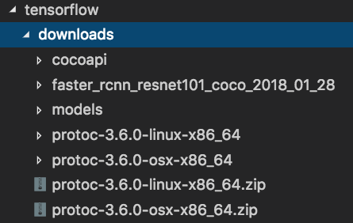

# 使用Google TensorFlow Object Api 实现物体识别 :sun_with_face:

> TensorFlow 环境准备
> 1. [安装步骤]（[models/installation.md at master · tensorflow/models · GitHub](https://github.com/tensorflow/models/blob/master/research/object_detection/g3doc/installation.md)）
>
> 2. 所需提前准备好使用包
>> 

> 物体识别步骤
>
>  1. 准备样本
>  2. 将需要训练的物体图片框选并标识出，整理成csv格式，使用特定标注工具
>  3. 将csv文件与图片一同整理成tfrecord，tfrecord是图片与标注点整理成的二进制文件
>  4. 生成好tfrecord之后开始训练模型
>  5. 将训练好的模型转换为预测结果
>  6. 使用预测结果进行图片识别判断

---
## 准备训练样本
  
  训练样本可以从多种渠道获得，自行百度，Google或者从现有一些数据集网站下载，例如[Kaggle: Your Home for Data Science](https://www.kaggle.com/) , [COCO - Common Objects in Context](http://cocodataset.org/#home) 和
  [Open Images Dataset V4](https://storage.googleapis.com/openimages/web/index.html)
  
  在我的这次训练中，使用的是纯图片数据，因此需要自行标注出需要识别的物体，所使用工具为[Labelimg](https://github.com/tzutalin/labelImg).标注只需要给与同一物体固定标签即可，此工具可在Ubuntu及Windows上正常运行，(MacOS 需要额外操作才可运行)，样本数量是越多越好
  
## 生成CSV文件

  当标注完成之后，使用xml_to_csv.py 将标注生成的xml文件生成CSV.
  **分为两批数据**， test数据，和 train数据，生成两个文件，一个是test_lable.csv, 另一个是train_lable.csv
  ```
  python xml_to_csv.py
  ```
## 生成tfrecord

  使用generate_tfrecord.py 生成训练所需 tfrecord
  
  ```
  python generate_tfrecord.py --csv_input=data/train_labels.csv  --output_path=data/train.record
  python generate_tfrecord.py --csv_input=data/test_labels.csv  --output_path=data/test.record
  ```

## TypeError: can't pickle dict_values objects 

```
add list() to category_index.values() in model_lib.py about line 381 as this list(category_index.values())
```
## Trainning
```
python model_main.py --model_dir=local_trained --pipeline_config_path=training/faster_rcnn_resnet101_local_train_coco.config
```
## 生成预测数据
 
 ```
 python export_inference_graph.py \
    --input_type image_tensor \
    --pipeline_config_path training/faster_rcnn_resnet101_coco.config \
    --trained_checkpoint_prefix gcloud_trained/model.ckpt-1192 \
    --output_directory gcloud_output_graph
 ```
 # 预测模型编译成Android可用的
 ```
 python /models/research/object_detection/export_tflite_ssd_graph.py --pipeline_config_path=training/ssd_mobilenet_v2_coco_2018_03_29/pipeline.config --trained_checkpoint_prefix=./local_trained/model.ckpt-150997 --output_directory=./tflite/ --add_postprocessing_op=true
 ```
# 转换成tflite文件
 ```
 tflite_convert --output_file=./tflite/excavator.tflite --graph_def_file=./tflite/tflite_graph.pb --input_arrays=normalized_input_image_tensor --output_arrays='TFLite_Detection_PostProcess','TFLite_Detection_PostProcess:1','TFLite_Detection_PostProcess:2','TFLite_Detection_PostProcess:3' --input_shapes=1,300,300,3 --allow_custom_ops
 ```
 # 300*300是训练模型时,pipeline.config 里面的fixed_shape_resizer
 
 预测数据生成好之后就可以开始使用其做物体识别了

  
